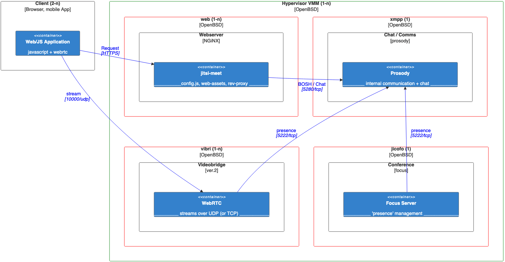
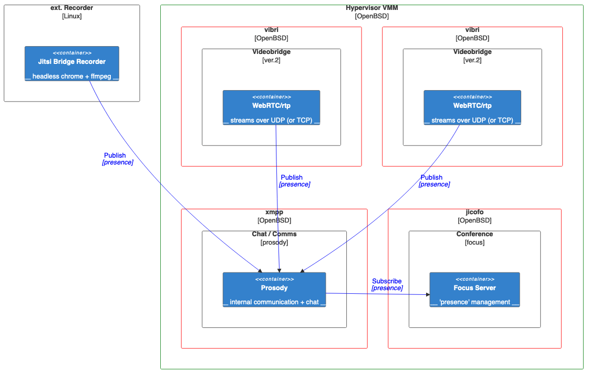

## What's ahead

:::: {.columns}
::: {.column width="50%"}

### Riddles Jitsi + OpenBSD
### Components / Terminology
### Install overview
### Configuration OpenBSD / Jitsi
### Watch out / Pitfalls
### Prayers and Demo
### Status + Outlook
:::
::: {.column width="50%"}
`https://is.gd/ontSw3`

:::
::::

## Riddles Jitsi
- so many components and than some
- even more communication, firewall nightmare?
- all localhost and "discovery magic"
- `location ~ ^/([^/?&:'"]+)/(.*)$`
- help? -> "quick install!", "one-debian VM"
- java, uuuh, two of 'em!
- how many in DNS again?
- who/where/what/wtf - towel launcher

## Riddles OpenBSD
- java + rcctl
- need Linux-VMs? yes/no/alpine?
- vm.conf examples / hoowl-toooo scarce
- inter VM networking ("the switch is dead")
- inside/outside networking (VMM as router)
- scale out (why VMs)

## Components OpenBSD
vmm(4) - virtual machine monitor:
: kernel driver isolating/providing the required resources for the VMs ("hypervisor")

vmd(8):
: userland daemon to interact with `vmm`

vmctl(8):
: administrative tool to create, start/stop, .. VMs

vm.conf(5):
: persist VMs resource configuration

## Components Jitsi
nginx(8): `web`
: serving web assets and reverse proxy BOSH or websockets
 <!-- Bidirectional-streams Over Synchronous HTTP -->

prosody(8): `xmpp`
: conference chat + internal components communication (esp. "PubSub" for health/discovery)

## Components Jitsi (c.)
focus: `jicofo` JItsi COnference FOcus
: room+session handling in conferences (who's talking to whom and where)

videobridge: `jvb`
: mediastream (WebRTC) handlings between participants (SFU)

jibri: JItsi BRoadcasting Infrastructure
: recording + streaming conferences

## Architecture OpenBSD
XXX VMM+VMs+"switch" pic via mermaid.live + screenshot or 'inline'?

## Architecture Jitsi (Net)
{.r-stretch}

## Architecture Jitsi (logical / ext.)
{.r-stretch}

## Install Overview
- create VM images
- /etc/vm.conf
- hosts / DNS
- nginx: install, config, certs
- prosody: install, config, certs, users
- jicofo: install, config
- jvb: install, config
DONE.

## VM installation
```{.bash code-line-numbers="|4,8"}
mkdir /home/vmm; cd /home/vmm
vmctl create -s 5G web.qcow2
ftp https://cdn.openbsd.org/pub/OpenBSD/7.1/amd64/install71.iso
vmctl start -m 2G -L -i 1 -r install71.iso -d /home/vmm/web.qcow2 web
vmctl console web
## run the (I)nstaller, default options. only one 'a' slice on (w)hole disk
## halt -p (so new sshd_keys per VM)
vmctl stop web
for vm in xmpp jicofo jvb ; do cp web.qcow2 $vm.qcow2; done
echo 'net.inet.ip.forwarding=1' >> /etc/sysctl.conf
```

## VMM `/etc/vm.conf`
```{.python code-line-numbers="1-6|7-9|10-17|"}
vm "web" {
  enable
  memory 2G
  disk "/home/vmm/web.qcow2" format qcow2
  local interface { up }
}
vm "web" instance "xmpp" {
  disk "/home/vmm/xmpp.qcow2" format qcow2
}
vm "web" instance "jicofo" {
  memory 4G
  disk "/home/vmm/jicofo.qcow2" format qcow2
}
vm "web" instance "jvb" {
  memory 4G
  disk "/home/vmm/jvb.qcow2" format qcow2
}
```

## DNS, `/etc/hosts`
:::{.callout-note}
DNS: only one A-RR for jitsi.fips.de, but `hosts` for jicofo
:::

```{.python code-line-numbers="|2"}
100.64.1.3    web
100.64.2.3    xmpp jitsi.fips.de
100.64.3.3    jicofo
100.64.4.3    jvb
```
:::{.callout-note}
adapt `/etc/myname` in each VM accordingly
:::

## `/etc/pf.conf` each VM, VMM

:::{.callout-note}
Not needed for jitsi itself, rather common admin care
:::
```{.python code-line-numbers="1|2|3|"}
block return log
pass out quick on egress proto { tcp udp } to any port { 123 53 80 443 }
pass in quick on egress proto tcp from $admin to port 22
```
:::{.callout-note}
block both ways; allow NTP, DNS, HTTP(S), SSH
:::

## `/etc/pf.conf` VMM (as router)  
Assuming all traffic hits the VMM external IP-address  
(`on egress`)

- jitsi specifics:

```{.python code-line-numbers="1|2|3-4|5|6|"}
pass in on egress proto tcp to any port { 80 443 } rdr-to web
pass in on egress proto udp to any port { 10000 } rdr-to jvb
pass in proto tcp from { jvb jicofo } to xmpp port 5222 # native
pass in proto tcp from web to xmpp port 5280 # http/BOSH
pass in on egress proto tcp to any port 5280 rdr-to xmpp # debug
```
- DNS
```{.python code-line-numbers="2"}
vms={ web xmpp jicofo jvb }
pass in proto { udp tcp } from $vms to any port domain rdr-to $resolver
```

## `/etc/pf.conf` web / nginx
```{.python code-line-numbers="1|2|"}
pass in quick on egress proto tcp to self port { 80 443 }
pass out quick on egress proto tcp to xmpp port 5280
```
:::{.callout-note}
BOSH or XMPP-websocket both run via 5280/tcp
:::

## `/etc/pf.conf` xmpp / prosody
```{.python code-line-numbers="1|2|3|"}
pass in proto tcp from { jicofo jvb } to self port { 5222 }
pass in proto tcp from web to self port 5280
pass in proto tcp from { $admin } to self port { 5280 5347} # debug
```
:::{.callout-note}
5347/tcp for explicit authentication if need be (not here)
:::

## `/etc/pf.conf` jvb / videobridge
```{.python code-line-numbers="1|2|"}
pass out quick on egress proto tcp to xmpp port { 5222 5280 }
pass in quick on egress proto udp to self port 10000
pass in quick on egress proto tcp from $monitor to self port 8080

```
:::{.callout-note}
for scale out the 10000/udp can be changed and would make
use of a port range e.g. '10000:10050' vertically or explicit rdr-to in VMM
for horizontally
:::
:::{.callout-note}
jvb has a REST API on 8080/tcp for health/metrics (prometheus)
:::

## `/etc/pf.conf` jicofo / focus server
```{.python code-line-numbers="1|"}
pass out quick on egress proto tcp to xmpp port 5222
pass in quick on egress proto tcp from $monitor to self port 8888
```
:::{.callout-note}
jicofo has a REST API on 8888/tcp for health/metrics (prometheus) - BROKEN
:::

## Install / Configuration prosody (xmpp)
Besides the package itself, we need some additional modules
```{.bash}
pkg_add unzip-- prosody
prosodyctl install --server=https://modules.prosody.im/rocks/ mod_client_proxy
prosodyctl install --server=https://modules.prosody.im/rocks/ mod_roster_command
```
:::{.callout-note}
The modules do not need further configuration. client_proxy gets autoloaded with
component configuration. roster_command is CLI only.
:::

## Configuration prosody (xmpp)
- `/etc/prosody/prosody.cfg.lua`: (shortened)
```{.lua code-line-numbers="|1,4|"}
http_interfaces = { "*", "::" }
VirtualHost "jitsi.fips.de"
    authentication = "anonymous";
    modules_enabled = { "bosh"; "pubsub"; }
    c2s_require_encryption = false

VirtualHost "auth.jitsi.fips.de"
    admins = { "focus@auth.jitsi.fips.de", "jvb@auth.jitsi.fips.de" }
    ssl = { key = "/var/prosody/auth.jitsi.fips.de.key";
            certificate = "/var/prosody/auth.jitsi.fips.de.crt"; }
    authentication = "internal_hashed"
```
:::{.callout-note}
`admins` usage details unclear
:::

## Configuration prosody (xmpp) (cont.)
- `/etc/prosody/prosody.cfg.lua`: (shortened)
```{.lua code-line-numbers="1|2,3|4,5|6-8|"}
Component "conference.jitsi.fips.de" "muc"
Component "jvb.jitsi.fips.de"
    component_secret = "CHANGE_jvb"
Component "focus.jitsi.fips.de" "client_proxy"
    target_address = "focus@auth.jitsi.fips.de"
Component "internal.auth.jitsi.fips.de" "muc"
    muc_room_locking = false
    muc_room_default_public_jids = true
```

:::{.callout-note}
No extra DNS needed! Like "Host:" HTTP-Header.  
`focus` like `jvb` in earlier versions (v1)
:::

## Prosody users
The connection for `jvb` uses a shared secret as shown on the previous page ("Component") but
also:
```{.bash}
rcctl enable prosody ; rcctl start prosody
prosodyctl register jvb auth.jitsi.fips.de CHANGE_JVB
```

Jicofo's "focus" user:
```{.bash}
prosodyctl register focus auth.jitsi.fips.de CHANGE_FOCUS
prosodyctl mod_roster_command subscribe focus.jitsi.fips.de focus@auth.jitsi.fips.de
```

:::{.callout-note}
Documentation a bit scarce about what's in for this subscription
:::

## TLS certificates (prosody / JKS)
```{.bash}
prosodyctl cert generate auth.jitsi.fips.de
cd /var/prosody
yes | /usr/local/jdk-11/bin/keytool -import -alias prosody -file \
  auth.jitsi.fips.de.crt -keystore jicofo-key.store -storepass jitsicool
cp jicofo-key.store jvb-key.store # copy to VM jicofo, jvb accordingly
```
:::{.callout-note}
`keytool` comes with JDK, this task can also be done on jicofo or jvb VM
:::

## Install nginx / web
nginx and the jitsi web elements
```{.bash}
pkg_add nginx
pkg_add jitsi-meet
```
Any TLS setup is mandatory or Chrome/Firefox/.. will refuse to let you
use the camera+microphone.  
Using Let's Encrypt with `acme-client` for the TLS setup is easily possible.

:::{.callout-note}
only needed jitsi configuration is config.js, see below
:::

## WEB / nginx.conf
`/etc/nginx/nginx.conf`
```{.nginx code-line-numbers="|1|2|3-4|5-7|8|9-12|13-14|"}
server_name  jitsi.fips.de;
root         /var/www/jitsi-meet;
ssi on;
ssi_types application/x-javascript application/javascript;
location ~ ^/(libs|css|static|images|fonts|lang|sounds|connection_optimization)/(.*)$ {
  add_header 'Access-Control-Allow-Origin' '*';
  alias /var/www/jitsi-meet/$1/$2; }
location /external_api.js { alias /var/www/jitsi-meet/libs/external_api.min.js; }
location = /http-bind {
  proxy_pass      http://xmpp:5280/http-bind;
  proxy_set_header X-Forwarded-For $remote_addr;
  proxy_set_header Host $http_host; }
location ~ ^/([a-zA-Z0-9=\?]+)$ {
  rewrite ^/(.*)$ / break; }
```
If using LE, put the `.well-known` location first (above L5)

## web / mobile client 
- `/var/www/jitsi-meet/config.js`:
```{.javascript code-line-numbers="3-4|6|7|8,10|13|"}
var config = {
  hosts: {
    domain: 'jitsi.fips.de',
    muc: 'conference.jitsi.fips.de' // no DNS
  },
  bosh: '//jitsi.fips.de/http-bind',
  useTurnUdp: false,
  prejoinConfig: {
    enabled: true,
    hideExtraJoinButtons: ['no-audio', 'by-phone'] },
  p2p: {
    stunServers: [
      { urls: 'stun:meet-jit-si-turnrelay.jitsi.net:443' } ] }
}
```
:::{.callout-note}
TURN depends on NAT environment(s)
:::

## Install / Config jicofo
- `pkg_add jicofo`
- adapt `/etc/jicofo/jicofo.in.sh` if need be
```{.bash code-line-numbers="1|2|3-4|5-6|"}
JICOFO_CONF=/etc/jicofo/jicofo.conf
JICOFO_LOG_CONFIG=/usr/local/share/jicofo/lib/logging.properties
JICOFO_TRUSTSTORE=/etc/ssl/jicofo-key.store
JICOFO_TRUSTSTORE_PASSWORD=jitsicool
JICOFO_MAXMEM=3G
JICOFO_DHKEYSIZE=2048
```

:::{.callout-tip}
jicofo-key.store is generated from prosody certificate, see earlier slide
:::


## Jitsi / jicofo
- `/etc/jicofo/jicofo.conf`: (shortened)
```{.javascript code-line-numbers="|2|3|4|8|14|"}
jicofo { bridge {
  brewery-jid = "JvbBrewery@internal.auth.jitsi.fips.de"
  xmpp-connection-name = Client } // enum
  sctp { enabled = false } 
  xmpp {
    client {
      port = 5222
      domain = "auth.jitsi.fips.de"
      username = "focus"
      password = "CHANGE_FOCUS"
      use-tls = true
    }
    // trusted service domains. Logged in -> advance to bridges
    trusted-domains = [ "auth.jitsi.fips.de" ]
  }
}
```
## Jitsi / jicofo (cont.)
- `/etc/rc.conf.local`:
```{.bash code-line-numbers="|"}
jicofo_flags="--host=jitsi.fips.de"
```
- `/etc/syslog.conf`
```{.text}
!jicofo
*.*     /var/log/jicofo
```

:::{.callout-important}
Needs `/etc/hosts` or split-DNS. Used for TCP connect AND virtualhost
:::

`rcctl enable jicofo ; rcctl start jicofo`

## Install / Config jvb
- `pkg_add jitsi-videobrige`
- adapt `/etc/jvb/jvb.in.sh` if need be
```{.bash code-line-numbers="1|2|3-4|5-7|8-10|"}
JVB_CONF=/etc/jvb/jvb.conf
JVB_LOG_CONFIG=/usr/local/share/jvb/lib/logging.properties
JVB_TRUSTSTORE=/etc/ssl/jvb-key.store
JVB_TRUSTSTORE_PASSWORD=jitsicool
JVB_MAXMEM=3G
JVB_DHKEYSIZE=2048
JVB_GC_TYPE=G1GC
# reads /etc/jvb/sip-communicator.properties
JVB_SC_HOME_LOCATION='/etc'
JVB_SC_HOME_NAME='jvb'
```

:::{.callout-tip}
jvb-key.store is generated from prosody certificate, see earlier slide. can be same file as /etc/jicofo/jicofo-key.store on one VM
:::
## Configuration `/etc/jvb/jvb.conf`
```{.javascript code-line-numbers="5|6|7,8|9,10|12|13-15|16-17|"}
videobridge { apis {
  xmpp-client {
   configs {
    ourprosody {
     hostname = "xmpp"
     domain = "auth.jitsi.fips.de" // 'realm'
     username = "jvb"
     password = "CHANGE_jvb"
     muc_jids = "JvbBrewery@internal.auth.jitsi.fips.de"
     muc_nickname = "jvb-foo"
     disable_certificate_verification = true } } } }
  sctp { enabled = false } // n/a on OpenBSD
  ice { tcp {
    enabled = false
    port = 443
   } udp {
    port = 10000
   }
  }
}
```

## Jitsi / jvb
`/etc/jvb/sip-communicator.properties`:
```{.java}
org.ice4j.ice.harvest.NAT_HARVESTER_LOCAL_ADDRESS=100.64.4.3
org.ice4j.ice.harvest.NAT_HARVESTER_PUBLIC_ADDRESS=87.253.170.146
org.ice4j.ice.harvest.DISABLE_AWS_HARVESTER=true
```
:::{.callout-note}
ice4j has not been migrated yet, thus not available in "new" JICO config format
:::

`/etc/syslog.conf`
```{.text}
!jvb
*.*     /var/log/jvb
```

`rcctl enable jvb ; rcctl start jvb`

## Pitfalls / Hints OpenBSD
- `rc.conf.local`: jicofo_flags: IP instead DNS/hosts
- startup ordering (web, xmpp, jicofo, jvb); avoid retries

## Pitfalls / Hints Jitsi
- xmpp: host vs. virtualhost vs. domain
- DNS: one and only one (or mess up xmpp fallback)
- not disabling sctp (jvb AND jicofo)
- (hidden) version bumps ("no longer component!")
- jicofo has an XMPP-packetlogger (see `logging.properties)
- Patience, be really patient (at initial start)
- always check the `,` in config.js (JSON after all..)

## Prayers for a Livedemo
### fips.de
[`https://jitsi.fips.de/EBC`](https://jitsi.fips.de/EBC)

Infrastructure kindly provided by Mischa Peters from [openbsd.amsterdam](https://openbsd.amsterdam)

## Status OpenBSD
:::{.callout-important}
IT WORKS!
:::

Ports / Packages [(Bonusslide)]{style="color:#cc0000"}

- `net/jitsi/videobridge`: [current/7.2](https://marc.info/?l=openbsd-ports-cvs&m=166307863805249&w=2)
- `net/jitsi/jicofo`: [current/7.2](https://marc.info/?l=openbsd-ports-cvs&m=166307863805249&w=2)
- `net/jitsi/meet`: [current/7.2](https://marc.info/?l=openbsd-ports-cvs&m=166307863805249&w=2)
- `www/jitsi-meta`: planned, include above and coherent configuration (all on localhost)

## Outlook scale
### scale / Cloudification
- `nginx`: easy scale out; protect nginx->xmpp (new CPU sink with TLS)
- `jvb`: ok; use statistics and only on IP only per instance
- `xmpp`: harder; what parameter to split on the frontend/nginx. how to tell jicofo(s)
- `jicofo`: unsure; not the workload horse, also 

## Outlook others
### Jibri / Jigasi / websockets
- `jibri`: maybe linux only (chrome-headless, fb/ffmpeg rip); otherwise like `jvb`
- `jigasi`: feel free / just no SIP
- `xmpp/jvb`: might move from BOSH to websockets eventually (who takes the perf hit)

### help
- community.jitsi.org: it's a rough place

## Questions ? / k-thx-bye
:::: {.columns}
::: {.column width="30%"}

:::
::: {.column width="40%"}
Thanks to:

- OpenBSD / Jitsi
- sysfive.com GmbH
- Aisha Tammy (ports)
- Mischa (obsd.ams)
:::
::: {.column width="30%"}
Misc:

- QUESTIONS
- Meet: Hallway
- No Lunch
:::
::::
:::{.callout-tip}
## Presentation
Created with `Quarto / revealjs`  
[presentation (+testing-config)](https://github.com/double-p/presentations/tree/master/EuroBSDcon/2022/)
`https://is.gd/ontSw3`
:::

## Bonus
### -current ports
- fetch snapshots ports.tar.gz and unpack in a temporary path
```{.bash}
CVSROOT=anoncvs.XX.openbsd.org:cvs
cd temppath/ports/net ; cvs up -Pd -A
cp -pr jitsi /usr/ports/net
cp ../infrastructure/db/user.list /usr/ports/infrastructure/db/
cd /usr/ports/net/jitsi ; make package # get a coffee/tea/..
scp /usr/ports/packages/amd64/all/jitsi-meet* web:/tmp
scp /usr/ports/packages/amd64/all/jitsi-videobridge* jvb:/tmp
scp /usr/ports/packages/amd64/all/jicofo* jicofo:/tmp
```
on each vm, install as so  
`TRUSTED_PKG_PATH="/tmp:https://cdn.openbsd.org/pub/OpenBSD/7.1/packages/amd64/"  pkg_add jicofo`